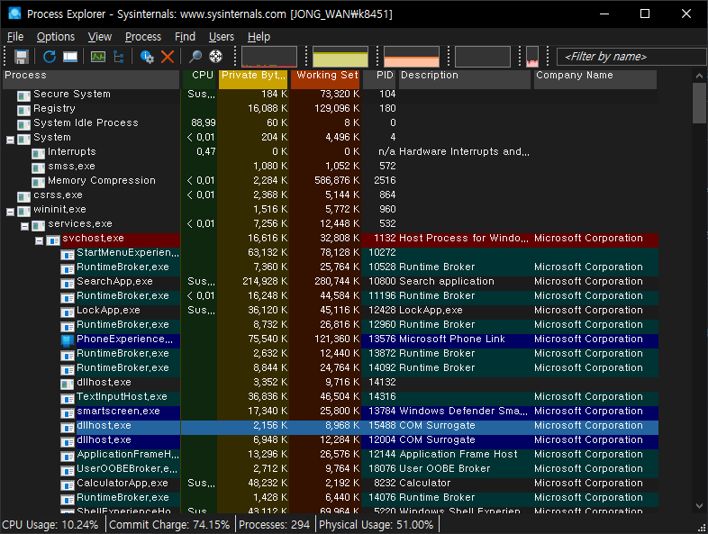

# Windows Tip.

[아이콘 쉘 오버레이](IconShellOverlay/README.md "탐색기에서 git 상태 아이콘이 나오지 않을때")   


# 파워쉘 : 원격 PC에 있는 exe, bat 파일 실행하기
https://www.sysnet.pe.kr/2/0/11450   
```
Invoke-Command -InDisconnectedSession -ComputerName <원격 PC 이름> -ScriptBlock {Invoke-Expression -Command:"start 'bat, exe 파일 패스'"}
```

### 윈도우10 탐색기 또는 오른쪽 마우스 클릭 시 프리징(멈춤, 응답없음) 해결
```
CMD 를 관리자 권한으로 실행.

> Dism /online /cleanup-image /restorehealth
  배포이미지 복원이 완료될때까지 기다림...
> sfc /scannow
  시스템 검사하여 시스템 손상 복구를 완료한다.
```


# Process Explorer 실행
- [참조](https://yjshin.tistory.com/632)
- Windows Key + R : \\live.sysinternals.com\Tools\procexp.exe


